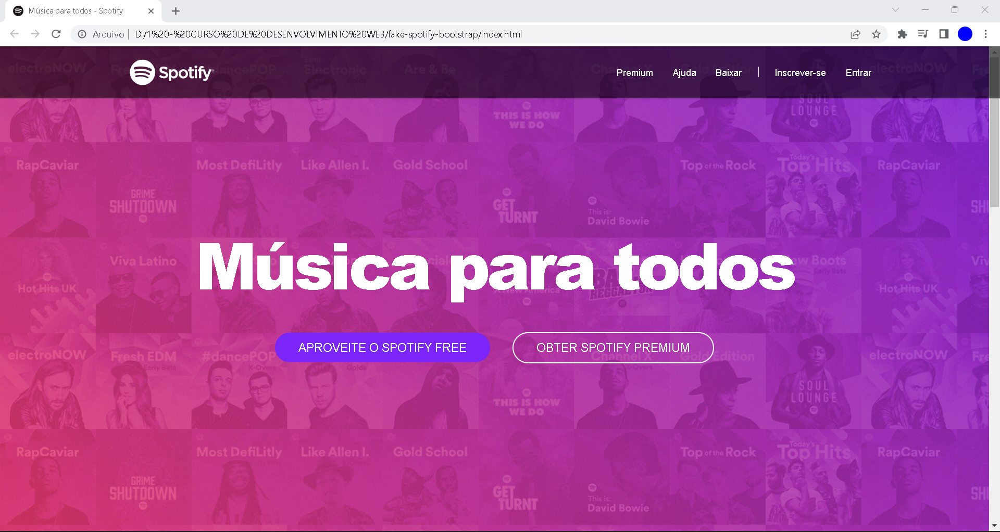
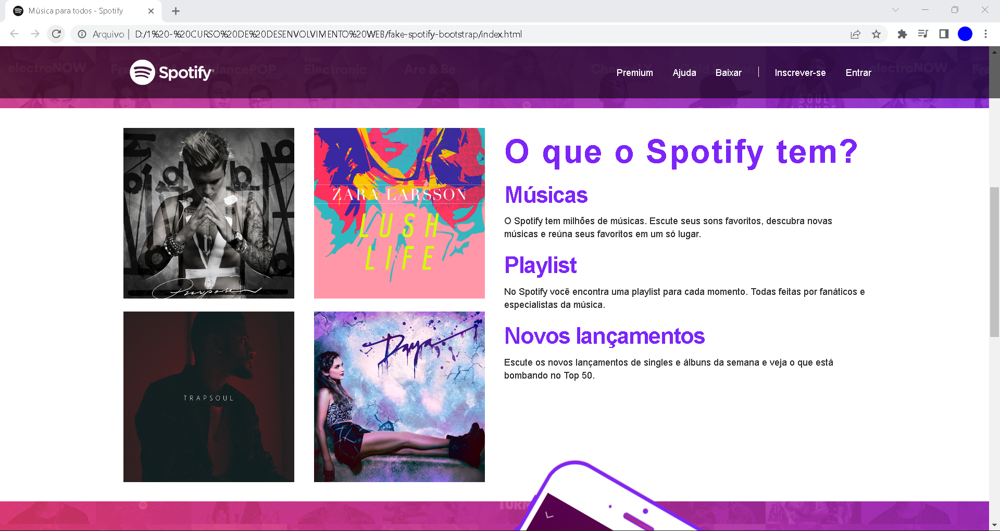
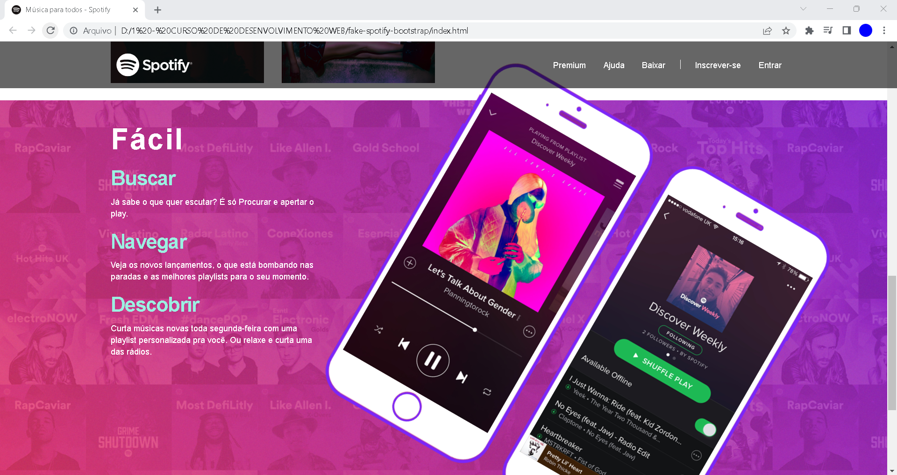

# Site do Spotify Fake

Pequeno projeto feito para começar o aprendizado de Bootstrap com um exercício prático proposto pelo professor Jamilton Damasceno, página Web construida com HTML, CSS e Bootstrap.

Inteiramente responsivo.

